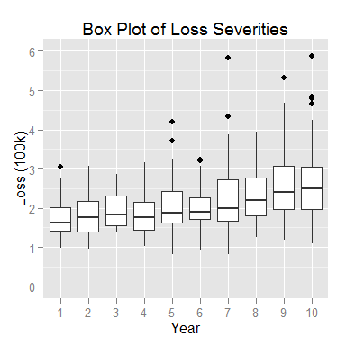

# Trend Estimation

This repository contains the following data sets:

# Starter For Ten

- All losses are fully developed
- Fixed number of losses (100) per year
- All losses from a single loss distribution

File: [data_set_1.csv](https://github.com/faradaypricing/trend-estimation/blob/master/data_set_1.csv)

 
