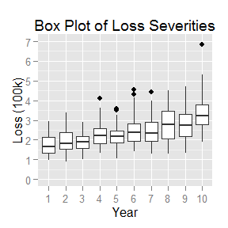
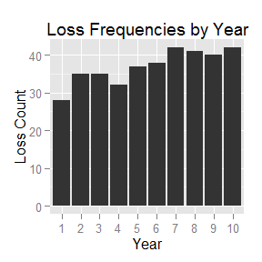
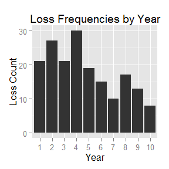
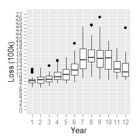

# Trend Estimation

# Overview

# Starter For Ten

- All losses are fully developed
- Fixed number of losses (50) per year
- All losses from a single loss distribution

File: [data_set_1.csv](https://github.com/faradaypricing/trend-estimation/blob/master/data_set_1.csv)

  

# Random Trend Rates

- All losses fully developed
- Random number of losses per year
- Random trend rate for each year (all sampled from the same distribution)

File: [data_set_2.csv](https://github.com/faradaypricing/trend-estimation/blob/master/data_set_2.csv)

  

# IBNR

- All losses fully developed
- Random number of losses per year
- Random trend rate for each year (all sampled from the same distribution)
- IBNR pattern applied to each year to limit reported claims

File: [data_set_3.csv](https://github.com/faradaypricing/trend-estimation/blob/master/data_set_3.csv)

  

# IBNER

- Random number of losses per year
- Random trend rate for each year (all sampled from the same distribution)
- IBNR pattern applied to each year to limit reported claims
- IBNER pattern (random) applied to each loss

File: [data_set_4.csv](https://github.com/faradaypricing/trend-estimation/blob/master/data_set_4.csv)

  

# Notification Level

- Random number of losses per year
- Random trend rate for each year (all sampled from the same distribution)
- IBNR pattern applied to each year to limit reported claims
- IBNER pattern (random) applied to each loss
- Notification level of 750,000

File: [data_set_5.csv](https://github.com/faradaypricing/trend-estimation/blob/master/data_set_5.csv)

  
